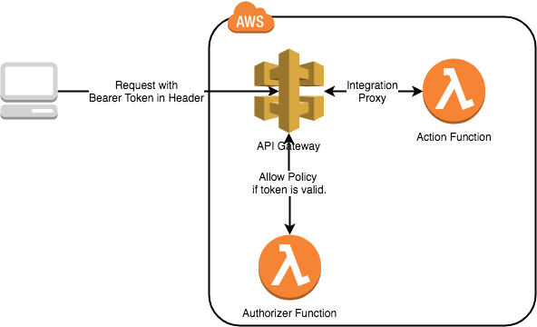

# Serverless Framework + Angular + Lambda Authorizer

## Overview



## Prerequirement

Install serverless cli.

```shellscript
npm i -g serverless
```

## Deploy Backend

### Install dependencies

Navigate to Folder

```shellscript
cd api
```

Install dependencies

```shellscript
npm i
```

### Deploy

Deploy backend environment

```shellscript
serverless deploy
```

## Deploy Front-end

### Install dependencies

Navigate to Folder

```shellscript
cd client
```

Install dependencies

```shellscript
npm i
```

Deploy to S3 + CloudFront

```shellscript
npm run build-deploy
```